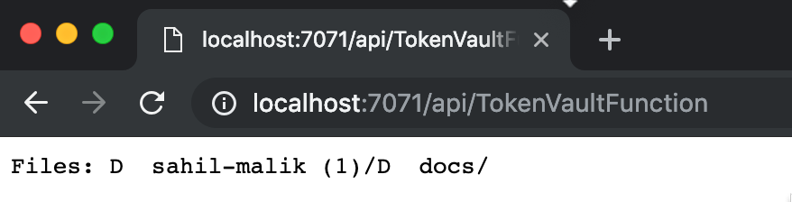

# Token Vault with Azure functions
This code example is intended to be a companion application to the web site token vault application you see [here](https://github.com/joerob-msft/app-service-msi-tokenvault-dotnet) .. go ahead and follow those instructions first and get that running first.

The intention of this application is to 
1. Act as a companion application once the user has granted access to the underlying resource.
2. Once such access has been granted, act as a headless third party application that can leverage the same token vault resources.

# How to use this application
1. Make sure you get the [token vault application](https://github.com/joerob-msft/app-service-msi-tokenvault-dotnet) working first.
2. Update the TokenVaultFunction line 30 and point it to your token vault instance,
```
string tokenResourceUrl = "https://<yourtokenvault>.westcentralus.tokenvault.azure.net/services/dropbox/tokens/sampleToken";
```
3. Run locally (or deploy to Azure)
4. Visit the function over a simple HTTP call, note that to keep things simple, the function uses no authentication itself (but can use authentication if necessary)
5. Verify that you can see your dropbox files as shown below,

